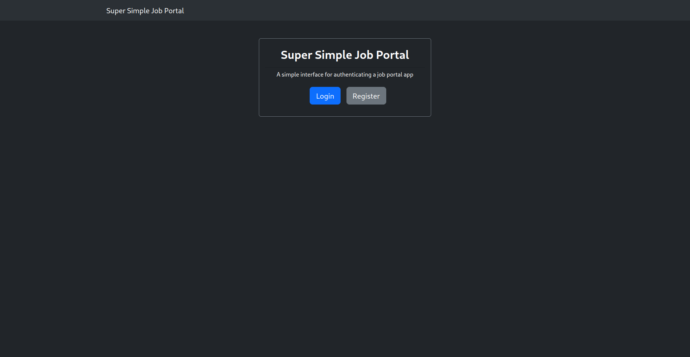
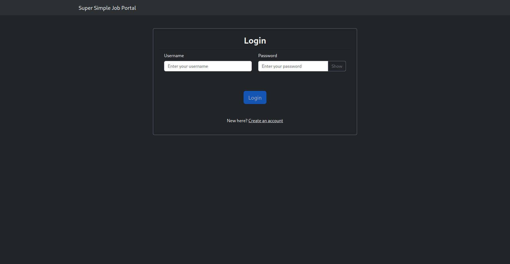
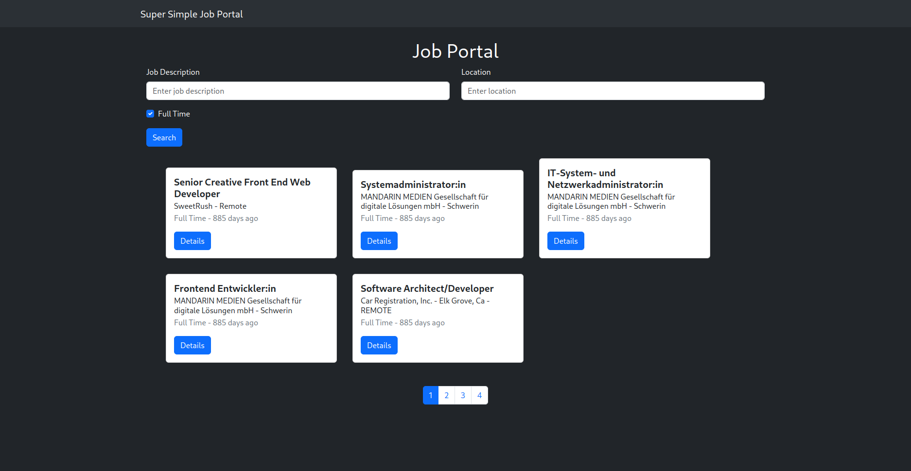
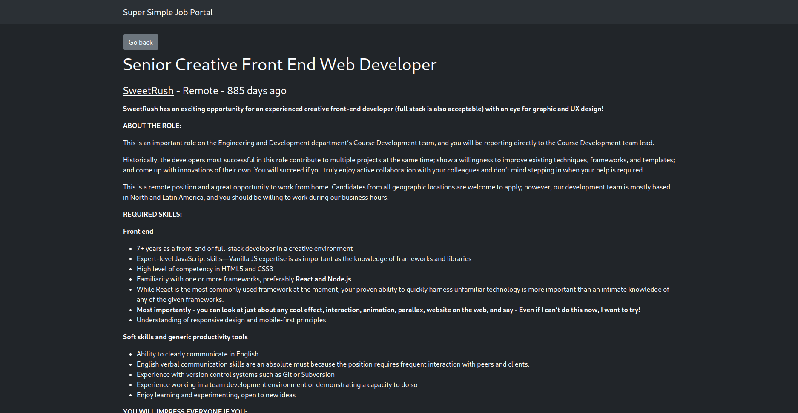

# Dans Recruitment Frontend

## Description

Job portal app created with MERN stack in mind using ReactJS and React Bootstrap using Typescript. This frontend app will serve basic user authentication, basic job search with pagination and filter, and job details lookup.

Acces the live demo page [here](https://dans-recruitment-frontend.vercel.app/).

## Features

- Homepage
- Login and Register page
- Job listing page with filter and searchbar
- Job details page

## Installation

```sh
// Clone the project repo
git clone git@github.com:alvinwilta/dans-recruitment-frontend.git

// Initialize and installing the project
cd dans-recruitment-frontend
npm install
```

## Usage

start server with `npm start`

start development server with `npm run dev`

start test with `npm run test`

eject the app with `npm run eject`

## Page Routes

| Route     | Description                                                                                         |
| --------- | --------------------------------------------------------------------------------------------------- |
| /         | Homepage - to select login or register <br>                        |
| /login    | Login page - input user credentials <br>                              |
| /register | Register page - create new user <br>                               |
| /jobs     | Job list page - search and filter available jobs <br>              |
| /jobs/:id | Job details page - In-depth detail about the job selected <br>  |
